Nama	    : Ngurah Acaryanandha Putra
NIM         : 260530911134
Divisi	    : Cybersecurity
Kategori    : Cyrptography

*TOOLS UMUM*
1. Pengujian WSL melalui command line interface.
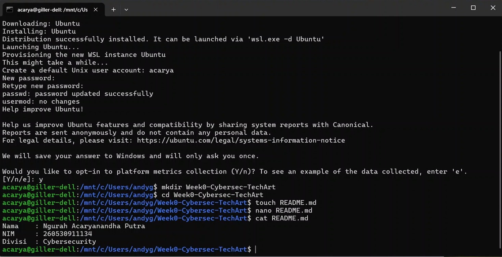

2. Pengujian Python
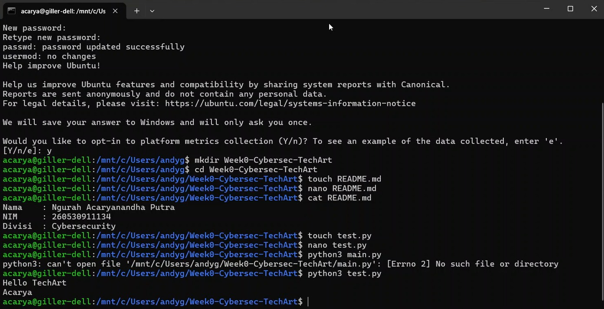

*PENGERJAAN CHALLANGE*

a. challange wajib
Step 1 
Saya menjalankan challange UNDO di Cylab lalu diberikan flag beserta hint dan disuruh untuk memasukkan perintah linux untuk membalikkan flag tersebut, sehingga saya memasukkan perintah base64 -d. Perintah tersebut berfungsi untuk menddekode flag yang sebelumnya disandikan menjadi plain text
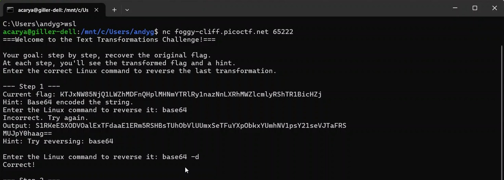

Step 2
Diberikan flag dengan hint Reversed the text, jadi flag ini disembunyikan dengan membalikkan urutan hurufnya sehingga perintah yang dipakai adalah rev atau singkatan dari reverse yang berfungsi untuk membalikkan lagi urutan hurufnya
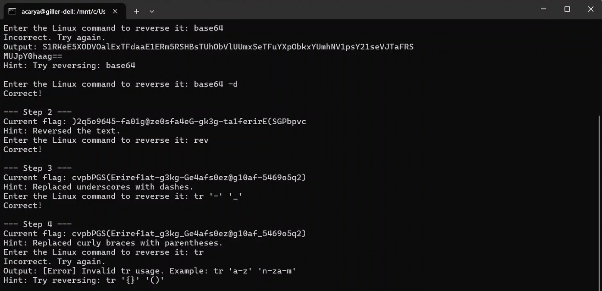

Step 3
Diberikan flag dengan hint replace underscore with dashes, jadi flag ini dapat diselesaikan dengan mengganti dashes atau tanda hubung menjadi underscore, hal itu dapat dilakukan dengan perintah tr atau translate '-' '_' sehingga setiap dashes atau tanda hubung yg ada pada flag digantikan menjadi underscore seperti semula.

Step 4
Mirip seperti step 3 tapi yang diganti adalah parantheses () menjadi curly braces {} dengan perintah yang sama juga yaitu tr atau translate '()' '{}' sehingga parantheses yang ada di flag digantikan oleh curly braces.
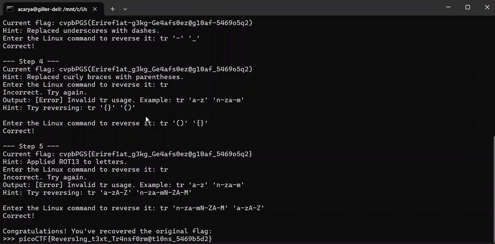

Step 5
Diberikan flag dengan hint apllied ROT13 to letters, Jujur disini saya searching terkait ROT13 (bukan AI harusnya). Jadi ROT13 itu sandi klasik yang menggeser setiap huruf sebanyak 13 posisi di alfabet seperti bahasa panda, perintah yang dapat dimasukkan yaitu tr atau translate 'n-za-mN-ZA-M' 'a-zA-Z', maksud dari 'n-za-mN-ZA-M' adalah empat rentang abjad yang digabung jadi 1 n-z, a-m, N-Z dan A-M lalu 'a-zA-Z' juga sama artinya adalah rentang abjad yang normal. Jadi perintah ini bekerja dengan cara jika komputer menemukan huruf n maka akan diganti menjadi a cara kerjaini akan terus mengulang sampai selesai. Sehingga menghasilkan flag yang sebenarnya.

Flag tersebut dapat dimasukkan ke web dan selesai
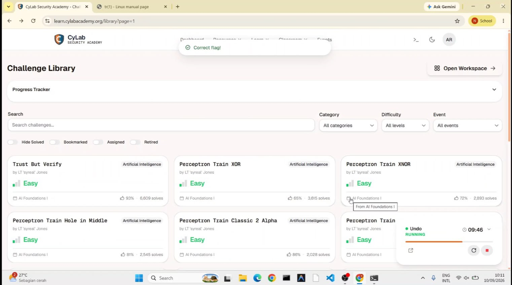

*Dokumentasi Kategori Cyrptography*
1. Membuat Python Virtual Environment (venv), menginstal library pycryptodome dan menjalankan kode yang telah diberikan
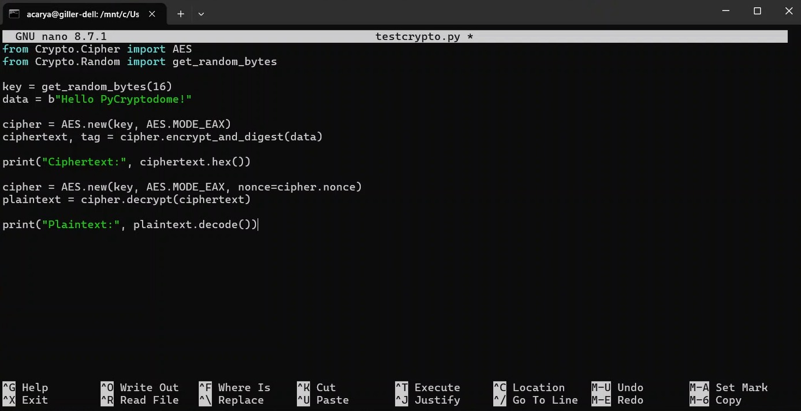
2. Outputnya
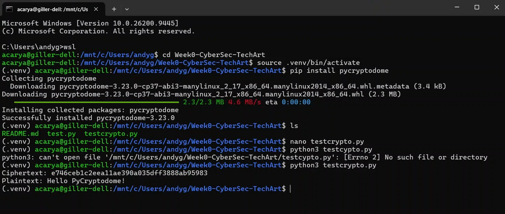
3. Mengerjakan challenge THE NUMBERS
pada challange ini diberikan foto yang berisikan angka angka, awalnya saya ga ngerti apa maksud angka - angka ini sehingga saya melakukan searching (bukan AI harusnya), akhirnya saya dapat mengetahui bahwa angka - angka tersebut ada representasi dari metode enkripsi A1Z26 Chiper (Number to Alphabet) jadi angka 1 itu mewakili huruf A, angka 2 mewakili huruf B dan seterusnya, kemudian cara angka - angka ini dapat kita terjemahkan ke dalam kode python yang pastinya saya melakukan searching (bukan AI harusnya) alhasil saya menggunakan Kode ASCII, dalam kode ASCII diketahui bahwa huruf 'A' itu bernilai 65 sehingga jika kita mempunyai angka 1 dan ditambahkan angka 64 yang hasilnya 65 dan angka tersebut dimasukkan ke dalam fungsi chr pada python maka akan menampilkan huruf 'A' dan hal ini berlaku untuk huruf huruf lainnya. Berikut foto angka dan kode python yang digunakan :

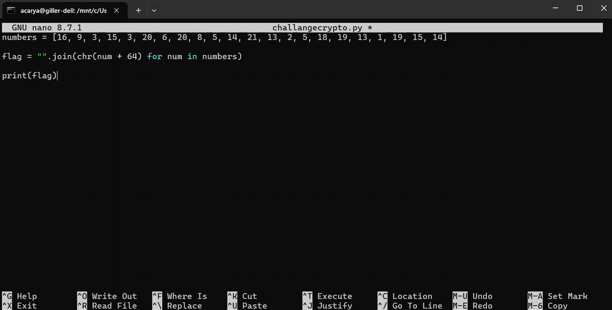
dan outputnya adalah :
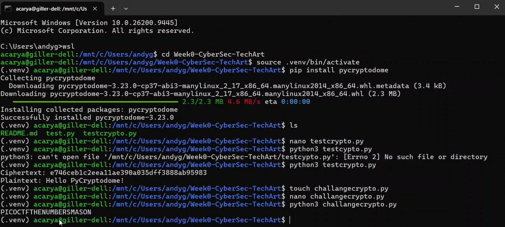
outputnya adalah PICOCTFTHENUMBERSMASON namun kalau di perhatikan pada foto angkanya terdapat kurung kurawa setelah 7 angka jadi setelah 7 huruf saya tambahkan juga kurung kurawa buka dan kurung kurawa tutup pada akhir sehingga sesuai dengan foto angka pada soal yaitu PICOCTF{THENUMBERSMASON} dan berhasil. Berikut foto web cylab:
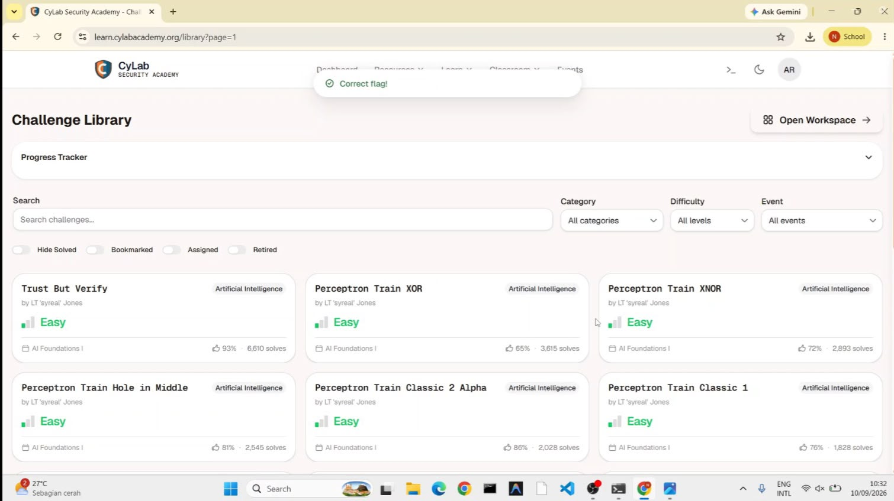

*Referensi*

Cylab Security Academy

Linux Manual Page

ASCII-code.com

A1Z26 cipher - wikipedia
